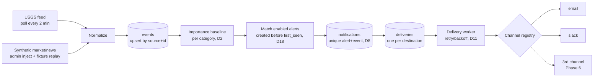

# Plan

Working plan for taking the brief (`docs/brief.pdf`) to a working implementation. Changes to this plan are logged in `PROCESS.md`.

## Known constraints

- **Frontend: Angular.** Fixed. Not revisited during design. Version 21 (21.2.x): Angular 22 needs Node ≥ 24.15.0 and this machine has 24.14.1 (user's choice in Phase 5).
- **Timebox: ~24h** (brief). A partial, well-reasoned result beats a complete, undocumented one, so phases are ordered so that stopping early still leaves something coherent.

## Acceptance criteria

**[Brief]** = taken directly from the brief's wording. **[Ours]** = our operationalization of something the brief states loosely. [Ours] criteria are design decisions, so they can be challenged and are confirmed or revised in Phase 1.

| # | Criterion | Source |
|---|-----------|--------|
| AC1 | Users can set up alerts. | [Brief] |
| AC2 | Users get notified when something important happens in the world (e.g. breaking news, market movements, natural disasters). | [Brief] |
| AC3 | Notifications can be delivered by email. | [Brief] |
| AC4 | Notifications can be delivered to Slack. | [Brief] |
| AC5 | More channels can be added later. | [Brief] |
| AC6 | There is an admin view. | [Brief] |
| AC7 | "Important" is defined by an explicit, documented, testable rule per event type, not left implicit or to an opaque judgment. | [Ours] |
| AC8 | At least one event category runs end-to-end from a real, verified data source; other categories may use recorded fixtures. The brief's list is illustrative ("that kind of thing"), not a checklist. | [Ours] |
| AC9 | AC5 is proven by adding a third, structurally different channel in its own commit. That commit touches only new files plus a registration point, with no edits to alert logic, dispatch, or existing channels. | [Ours] |
| AC10 | One source event produces at most one notification per matching alert (dedup). Cross-source clustering is out of scope (see D8). | [Ours] |
| AC11 | Every delivery attempt is recorded with its status; failures are visible in the admin view. | [Ours] |
| AC12 | The app runs locally and can be demoed without real Slack or email credentials (local mail catcher, Slack stub or webhook), and events can be injected or replayed on demand. | [Ours] |

## Decisions (Phase 1)

All of these are our decisions, not the brief's. D2, D4, and D8 were revised after Phase 2 (see `docs/data-sources.md`).

**Alert model**
- **D1. Alert** = one category + category-specific filters (disaster: min magnitude; market: symbol from a supported list + % move; news: keywords) + one or more destinations. Free-text/LLM-interpreted alerts rejected: non-deterministic, conflicts with AC7.
- **D2. Importance** (revised after Phase 2). A system baseline per category, which users can raise but not lower. Disasters (USGS earthquakes): **magnitude**, system minimum M5.0 (our choice). USGS's `alert` (PAGER) field isn't used: it's null on almost all events. Market: % change vs. previous close, system minimum 2%. News: keyword match on the synthetic feed. This is the weakest rule, since news has no objective importance signal and no real feed behind it.
- **D3. No geographic filter.** Deferred. Known gap: "near me" not supported.
- **D4. Real source** (revised after Phase 2). **USGS earthquake feed is the one real, live source** (verified, public domain; see `docs/data-sources.md`). This satisfies AC8. Disasters therefore means earthquakes only. **Market and news are synthetic from the start**, clearly labeled as such in the UI and README. No further source testing.

**Delivery**
- **D5.** Immediate delivery only. Digests and quiet hours deferred.
- **D6.** One alert can fan out to several destinations.
- **D7.** Destinations (email address, Slack webhook URL) are a separate per-user entity that alerts reference. Channel config stays out of the alert model.
- **D8. Dedup** (revised after Phase 2) by the source's own event ID: USGS `id`; market: symbol + trading day (revised in Phase 3: a growing move is a revision, not a new event). One notification per event per alert. USGS revises events after publication (`updated` > `time`), so updated events are re-evaluated: a revision never re-notifies an alert already notified, but an event revised *into* an alert's threshold notifies then. Known risk: USGS's `ids` list suggests an event's ID can change; unverified. Cross-source clustering deferred; AC10 reworded to "source event" because of this.
- **D9. Slack** via incoming webhooks (user-supplied URL, posts to a channel, not a DM). Slack app with OAuth rejected: needs registration and a public redirect URL.
- **D10. Email** via SMTP, local mail catcher for the demo. Provider swapped by config.
- **D11. Failures:** retry with backoff up to a limit, then marked failed, shown in the admin view, with manual retry.

**Users and admin**
- **D12. Auth:** email + password, roles `user` and `admin`, seeded demo accounts. No email verification or password reset.
- **D13. Admin view:** all users and their alerts (can disable an alert); event feed with each importance verdict and why; delivery log with failures and retry; source health; an "inject test event" tool running through the full pipeline. Out: editing rules in the UI, manual broadcasts, runtime channel toggles.

**Scope**
- **D14.** "Add more channels later" = code-level interface + registry, not an admin setting.
- **D15. Third channel (confirmed and built in Phase 6):** generic outbound webhook (JSON POST, optional HMAC signature). SMS rejected: needs a provider account, can't be tested offline.
- **D16.** No LLM in the product for v1.
- **D17.** Demo scale, local only, polling every few minutes. How it runs is decided in Phase 3.

**Explicit assumptions**
- **D18. No backfill:** a new alert fires only on events ingested after it's created.
- **D19.** One event matching two alerts of the same user produces two notifications (one per alert).
- **D20.** Times stored in UTC, shown in the browser's time zone.
- **D21.** Notification content: title, category, severity, time, source link, and which alert matched and why.

**Nice-to-have (not built by default)**
- Users editing, pausing, or deleting their own alerts. Not in the brief and maps to no AC. Consequence: in the core build, a user can't stop their own alert; only an admin can disable it (D13).
- Self-signup (D12).

## Phases

Each phase ends with the **validation gate** (below) and a milestone commit on `main`.

### Phase 1: Product decisions
Resolve the brief's ambiguities: the alert model, what counts as "important", delivery timing, Slack mode, auth model, and admin scope. Each gets a decision or an explicit deferral.
- **Produces:** updates to this file: confirmed or revised [Ours] criteria, plus each decision and any assumption behind it, labeled as such.
- **Phase check:** every ambiguity found in the brief analysis is either decided or explicitly deferred. Nothing is assumed silently.

### Phase 2: Data source verification spike
Check the candidate sources (disaster, market, news feeds) by making real requests, not by trusting descriptions.
- **Produces:** `docs/data-sources.md` (endpoint, auth, rate limits, terms, sample payload, verdict per source) and recorded payloads under `fixtures/`.
- **Phase check:** every claim about a source (URL, fields, limits, license) is backed by a real response or the provider's own docs. Sources that fail are logged as rejected. Provisional decisions D2 and D4 are confirmed or revised.

### Phase 3: Architecture and data model
Backend stack, domain model (events, alerts, users, channels, deliveries), the channel abstraction, and the ingest → detect → match → dispatch flow.
- **Produces:** the architecture written into this section (short, with one diagram) and the schema. If the design grows too complex for a short section, Claude explains why and asks before splitting it into a separate file.
- **Phase check:** every AC maps to a component. The channel interface is checked on paper against email, Slack, and a third hypothetical channel before any code exists.

#### Result (reviewed)

**Stack**
- **Backend:** Node 24 + TypeScript + Express. One process: HTTP API, USGS poller, and delivery worker. No queue or cache service (D17: demo scale).
- **DB:** SQLite via `better-sqlite3`. Verified on Node 24.14 / Windows: v13.0.3 installs from a prebuilt binary (no compile), and unique violations raise `SQLITE_CONSTRAINT_UNIQUE`. Chosen over Node's built-in `node:sqlite`, which works but prints an `ExperimentalWarning`.
- **Auth:** passwords hashed with `node:crypto` scrypt; signed session token in an httpOnly cookie.
- **Email:** SMTP (nodemailer) to Mailpit in Docker for the demo. Image and ports verified in Phase 4 (see Phase 4 result).
- **Slack demo:** a small local stub that accepts webhook POSTs and records them, so no real Slack workspace is needed (AC12). Real webhook URLs work unchanged.
- **Frontend:** Angular (fixed). **Tests:** Vitest.

**Flow**



New and *revised* events both go through importance and matching. Dedup is enforced by the `notifications` unique key, so a revision never re-notifies an alert, but an event revised into a threshold notifies then (D8).

**Channel abstraction**
```ts
interface Channel {
  type: string;                            // 'email' | 'slack' | ...
  configFields: ConfigField[];             // drives the destination form in Angular
  validateConfig(raw: unknown): Config;    // on destination create
  send(n: Notification, cfg: Config): Promise<SendResult>;
}
type SendResult = { ok: true } | { ok: false; retryable: boolean; error: string };
```
`Notification` is channel-neutral (title, category, severity text, time, source link, alert name, match reason; D21). Each channel formats it itself. The registry is a map from `type` to `Channel`.

**Paper check against three channels**

| | Email | Slack | Webhook (Phase 6 candidate) |
|---|---|---|---|
| Config | `address` | `webhookUrl` | `url`, optional `secret` |
| Payload | subject + text/HTML | JSON `text` | JSON body + HMAC header |
| Failure → `retryable` | SMTP 4xx, connection error | 429, 5xx, timeout | 5xx, timeout |
| Failure → permanent | SMTP 5xx (bad address) | 4xx (invalid/revoked URL) | 4xx |

SMTP classes follow the standard 4xx transient / 5xx permanent split. Slack's error behaviour was checked in Phase 4 (see Phase 4 result).

All three fit the interface without changes. **Finding from the check:** the channel config form lives in Angular. If each channel had a hand-built form, a third channel would need frontend edits and AC9 would fail. That's why `configFields` exists: Angular renders destination forms generically from field descriptors (name, label, kind: text/email/url/secret, required).

**Schema (SQLite)**

| Table | Key columns | Notes |
|---|---|---|
| `users` | id, email (unique), password_hash, role | role: `user`/`admin` (D12) |
| `destinations` | id, user_id, channel_type, label, config_json | D7 |
| `alerts` | id, user_id, name, category, filters_json, enabled, created_at | enabled: admin disable only (D13) |
| `alert_destinations` | alert_id, destination_id | fan-out (D6) |
| `events` | id, source, source_event_id, category, title, url, occurred_at, data_json, synthetic, first_seen_at, last_updated_at, baseline_passed, baseline_reason | unique (source, source_event_id); verdict + reason shown in admin (AC7) |
| `notifications` | id, alert_id, event_id, reason, created_at | **unique (alert_id, event_id)** = dedup (AC10) |
| `deliveries` | id, notification_id, destination_id, status, attempts, last_error, next_attempt_at, sent_at | status: pending/retrying/sent/failed (AC11) |
| `source_status` | source, last_success_at, last_error, last_error_at | source health (D13) |

Filters by category: earthquake `{minMagnitude ≥ 5.0}`, market `{symbol, minChangePct ≥ 2}`, news `{keywords[]}`.

**AC → component**

| AC | Covered by |
|---|---|
| AC1 | alerts API + Angular alert form |
| AC2 | poller/injector → importance → matching |
| AC3, AC4 | email and slack channels |
| AC5, AC9 | `Channel` interface + registry + generic `configFields` forms; proven in Phase 6 |
| AC6 | admin API + Angular admin view |
| AC7 | per-category baseline rules; `baseline_reason` stored per event |
| AC8 | USGS poller |
| AC10 | `notifications` unique key |
| AC11 | `deliveries` table + worker + admin delivery log |
| AC12 | Mailpit + Slack stub via Docker Compose; admin inject; fixture replay |


### Phase 4: Backend core with email and Slack
Ingestion, normalization, importance rules, matching, dedup, dispatch, delivery log, and the email and Slack channels. Includes a way to inject or replay events.
- **Produces:** backend code and tests driven by the Phase 2 fixtures.
- **Phase check:** tests pass, including dedup and channel-failure cases. There is a manual end-to-end run: inject an event, see the email in the mail catcher, see the Slack message or stub call.

#### Result

**Verified (previously unverified)**
- **Mailpit:** `axllent/mailpit`, pinned to `v1.31.2` (tag confirmed to exist). Exposed ports from `docker image inspect`: 1025 SMTP (no TLS), 8025 web UI + API, 1110 POP3 (unused). `GET /api/v1/messages` returns 200.
- **Slack webhooks:** a real POST to a made-up workspace returns **404 with plain-text body `no_team`** (not JSON), for valid JSON, empty JSON and non-JSON bodies alike. Slack's docs (read via a summarizing fetch) list error strings for 400/403/404 and say nothing about 429. Classification: 2xx ok; 429 and 5xx retryable; other 4xx permanent.
- **nodemailer:** `err.responseCode` is set from the SMTP reply (`smtp-connection/index.js:826`), so 5xx → permanent, 4xx/connection errors → retryable.
- **better-sqlite3 13.0.3** ships prebuilt binaries in the package (incl. win32-x64). Its implicit `node-gyp rebuild` install script and esbuild's postinstall are explicitly denied in `backend/package.json` (`allowScripts`), so a fresh clone never attempts a native build.

**Built** (`backend/`): schema, USGS poller and normalizer, synthetic market/news/earthquake injection and fixture replay (`fixtures/synthetic/`), importance and matching, ingest with dedup/revision/no-backfill, delivery worker with retry/backoff and per-attempt log, email and Slack channels, cookie-session auth, user and admin APIs, a local Slack stub (`npm run slack-stub`; hooks `fail-404`/`fail-500` simulate failures), `docker-compose.yml` for Mailpit.

**Changes from Phase 3**
- Added `delivery_attempts` table: the Phase 3 schema only kept the latest attempt per delivery, which doesn't meet AC11 ("every delivery attempt is recorded").
- Slack webhook URLs are restricted to an allowlist of prefixes (default: `https://hooks.slack.com/`, `http://localhost:4010/`), since the server POSTs to user-supplied URLs (SSRF).
- The AC9 registration point is `backend/src/channels/index.ts`: in practice an import line plus one array entry.

**Evidence**
- `npm test`: 41 tests pass; `npm run typecheck` clean.
- **Mutation check:** switching dedup from `INSERT OR IGNORE` to `INSERT OR REPLACE` fails 3 dedup tests; removing the no-backfill condition fails the D18 test. Restored file verified byte-identical.
- **End-to-end** (Mailpit + Slack stub + backend on a fresh DB): real USGS poll fetched 12 events; a user alert (M ≥ 6) with email, stub Slack and a `fail-404` Slack destination; an injected M7.2 produced an email in Mailpit and a stub Slack message; the `fail-404` delivery was marked failed after 1 attempt with `HTTP 404: no_service` and stayed failed. A news alert on "wildfire" matched the replayed synthetic headline.

**Still unverified / known gaps:** whether a USGS event's `id` can change (D8 risk); Slack's behaviour on rate limiting; demo credentials and the default session secret are dev-only.

**Run (dev):** `docker compose up -d` → `cd backend && npm install && npm run slack-stub` (second terminal) → `npm start`. API on :3000, Mailpit UI on :8025. Demo logins: `admin@example.com` / `admin123`, `alice@example.com` / `alice123`.

### Phase 5: Angular frontend
The user UI for creating alerts and managing destinations, and the admin view (scope per D13).
- **Produces:** Angular app wired to the backend, and screenshots in `docs/screenshots/`.
- **Phase check:** the app builds, and the demo flow works in the browser: create an alert → inject an event → the notification arrives → the delivery shows in the admin view.

#### Result

**Built** (`frontend/`, Angular 21.2, standalone + zoneless + signals, no SSR): login; **My alerts** (destinations list + add form rendered generically from each channel's `configFields`; alerts list + create form with category-specific filters and destination checkboxes); **Admin** (D13) with tabs for the delivery log (status, attempts, last error, per-attempt tooltip, manual retry), event feed (importance verdict + reason, inject test event, replay fixtures), users & alerts (disable/enable), and source health (poll USGS now). Dev proxy `/api` → `:3000`. No user edit/pause/delete (nice-to-have). The native modules' skipped install scripts (`@parcel/watcher`, `lmdb`, `msgpackr-extract`, `esbuild`) are denied explicitly, as in the backend; their binaries come from platform packages.

**Evidence**
- `npx ng build`: clean, no warnings.
- Browser check (`docs/screenshots/demo-flow.mjs`, headless Edge via Playwright, fresh DB): 16 checks pass. They cover: anonymous → login redirect; masked webhook URLs; a below-baseline alert rejected with the backend's message; a non-admin can't reach `/admin`; an admin injects an M7.2 quake and a "wildfire" headline, which yield 4 deliveries (3 sent, the `fail-404` hook failed with `HTTP 404: no_service`); the email arrives in Mailpit.
- Screenshots `docs/screenshots/01`–`08`, reviewed by eye. The event feed shows real USGS quakes with verdicts; the real M5.1–M5.3 events passed the baseline but notified nobody, as expected (the alert needs M ≥ 6 and D18 excludes events seen before the alert existed).
- **Bug found by the browser run:** route guards called `inject()` after `await`, outside Angular's injection context, so the redirect to `/login` silently failed (landed on `/`). Fixed by resolving services before awaiting. Build and typecheck couldn't catch it.

**Known rough edges:** after creating an alert the filter fields keep their values; the admin notice message persists across tabs; the delivery log refreshes on demand (Refresh button), not live.

### Phase 6: Third channel (AC5/AC9)
Add a third channel in its own commit, as the evidence for AC5.
- **Channel choice:** structurally different from email and Slack (e.g. generic outbound webhook or SMS), with different config, payload, or failure modes. A near-copy of an existing channel would pass without testing whether the abstraction generalizes.
- **Diff measurement:** the commit should need only new files plus one registration line. Any change to core alert logic, dispatch, or existing channels is a finding and is logged in `PROCESS.md`.
- **Produces:** the channel, its tests, and the commit's diff-stat recorded in the commit message and in this phase's result below.
- **Phase check:** AC9, judged by the actual diff.

#### Result

**Channel:** `webhook` (`backend/src/channels/webhook.ts`). Config `url` + optional `secret`; JSON POST; if a secret is set, `X-EventPulse-Signature: sha256=HMAC(secret, "<timestamp>.<body>")` with `X-EventPulse-Timestamp`; redirects not followed (they could leave the allowlist); 2xx ok, 408/429/5xx retryable, other statuses permanent. It differs structurally from email and Slack: arbitrary endpoint with its own allowlist, a signing secret, an optional field, and a request-signing step.

**Diff of the channel change**

| File | Change |
|---|---|
| `backend/src/channels/webhook.ts` | new, 72 lines |
| `backend/test/webhook.test.ts` | new, 97 lines |
| `backend/src/channels/index.ts` (registration point) | +2 (import + registry entry) |
| `backend/src/config.ts` | +2 (`webhookAllowedPrefixes` + comment) |
| pipeline, delivery worker, email/Slack channels, channel types/registry, DB schema, **frontend** | **0** |

**Verdict on AC9: partly holds.** The core flow (ingest → match → deliver) and the frontend needed no changes: the new channel's form rendered from `configFields`, and deliveries, retries and the admin log handled it as-is. Two things fell outside "new files + registration point":
1. **Config coupling (`config.ts`, +2):** channel settings live in the shared config module, so any channel that needs its own setting (here an SSRF allowlist) must edit it. The design has no per-channel config mechanism.
2. **A latent core bug (`app.ts`, fixed in a separate commit):** `maskConfig` showed the first 24 characters of any sensitive value, which was designed around Slack URLs (whose first 24 characters are the public `https://hooks.slack.com/`). The webhook's short signing secret was therefore shown in full in the destinations list. Email and Slack never triggered it. Masking now keeps only a URL's origin and fully hides other values.

**Evidence**
- `npm test`: 49 pass (7 new webhook tests, including one that sends a real ingested event through the unchanged worker to a local HTTP receiver); typecheck clean.
- Mutation checks: following redirects fails the redirect test. Signing without the timestamp **initially passed** because the test recomputed the signature with the same function under test. The test now computes the HMAC independently, and the mutation fails it.
- Browser (`docs/screenshots/webhook-flow.mjs`, unchanged frontend): 7 checks pass. The dropdown lists Email/Slack/Webhook, the form renders both fields with the secret optional, the secret is fully masked in the list, the delivery is `sent`, and the receiver got the JSON payload. Screenshots `09`, `10`. Phase 5 screenshots `01`–`08` regenerated after the masking fix (all 16 checks pass).

**Known gaps:** sensitive fields are typed in plain text in the form (the frontend chooses the input type from `kind`, not `sensitive`; see `09`); `08-mailpit-inbox.png` also shows demo emails from a parallel session.

### Phase 7: Wrap-up
- **Produces:** the finished `README.md` (a working version with run steps, real vs. synthetic data, and the dev-only credentials caveat exists since Phase 5; add known gaps), and a short retrospective of what's incomplete and why.
- **Phase check:** a fresh clone runs by following the README alone.

#### Result

**README** finished: what's real vs. synthetic, how it works, run steps (one terminal per service), all 12 backend settings (checked against `config.ts`), dev-only credentials with the production checklist, known gaps, and a map of the process and evidence files.

**Fresh-clone check** (clone of `0b4eb42` into a temp dir, following the README):
- `docker compose up -d` → reused the running Mailpit container (same Compose project name).
- Backend `npm install`: 5 s, no native build. `npm test`: 49 pass. Typecheck clean.
- Frontend `npm install`: 22 s. `ng build`: clean.
- Both committed browser scripts pass against the clone with **README defaults** (demo flow 16/16, webhook flow 7/7).
- **Deviation:** a parallel instance of the app was running on :3000 and :4200, so the clone ran on :3100 and :4300 (`PORT=3100`, `ng serve --port 4300` with a proxy to :3100). Nothing else differed from the README.
- **Found by the check:** the browser scripts only passed with `WORKER_TICK_MS=1000`, which every earlier run had set and the README doesn't. With the default 5 s tick, a fixed 3 s wait saw deliveries still `pending`. Both scripts now poll the admin API until deliveries settle. The webhook script also counted stub messages from earlier runs (the stub keeps them in memory); it now counts only its own.

#### Retrospective

**Acceptance criteria**

| AC | Status | Evidence / caveat |
|---|---|---|
| AC1 set up alerts | ✅ | UI + API; `03-my-alerts.png` |
| AC2 notified on important events | ✅ | Live for earthquakes; market and news synthetic (D4) |
| AC3 email | ✅ | Delivered to Mailpit; no real SMTP provider tested |
| AC4 Slack | ✅, partly verified | Success path via local stub only; real Slack verified only for its error response |
| AC5 more channels later | ✅ | Webhook added in `87363cb` |
| AC6 admin view | ✅ | D13 scope; screenshots 04–07 |
| AC7 explicit importance rule | ✅ | Verdict + reason per event; news rule is weak by nature |
| AC8 one real source | ✅ | USGS, live |
| AC9 channel needs only new files + registration | ⚠️ partly | +2 lines in shared `config.ts`; exposed a masking bug in core (fixed separately) |
| AC10 dedup | ✅ | Unique key + tests + mutation check; USGS id-change risk unverified |
| AC11 every attempt recorded | ✅ | `delivery_attempts` (added in Phase 4 after the Phase 3 schema missed it) |
| AC12 local demo without credentials | ✅ | Mailpit + stub; inject/replay |

**What the AI got wrong, and what caught it** (details in `PROCESS.md`):
- *Stated from memory, wrong in reality:* data-source URLs (GDACS, Stooq), USGS's `alert` field as a severity signal, Angular 22 on this Node version. **Caught by** real requests and running the tools.
- *Summary treated as source:* GDACS terms described from a fetch tool's summary, then drifted into "not prohibited". **Caught by** the user asking for the actual quoted line.
- *Invented facts in the log itself:* two `PROCESS.md` timestamps typed without checking the clock. **Caught by** comparing against the real time.
- *Design gaps:* the Phase 3 schema missed AC11's per-attempt record; masking only worked for Slack URLs; route guards used `inject()` after `await`. **Caught by** writing the code against the ACs, the third channel, and a real-browser run respectively. Build and typecheck passed in every case.
- *Tests that couldn't fail:* a signature test that recomputed with the function under test; an API masking test that only checked for a trailing "…". **Caught by** deliberate mutations and the browser check.
- *Scope creep:* alert edit/pause proposed as "cheap"; a separate decisions file; a separate architecture doc. **Caught by** user review.
- *False pointers:* code comments and a log line referring to a README that didn't exist yet. **Caught by** the user asking to confirm.

**What worked:** verifying before building (Phase 2 before Phase 3); a validation gate at every phase instead of at the end; mutation checks on tests that passed first time; a real-browser run for the UI; a third channel as the extensibility test, measured by its actual diff.

**Next steps:** test real Slack and a real SMTP provider; add per-channel config so channels stop editing `config.ts`; render `sensitive` fields as password inputs; confirm how USGS handles event-id changes; add frontend unit tests; production hardening per the README checklist.

**Time:** about 5 hours of the suggested 24 (13:49 → 18:5x on 2026-09-25).

**Cut line if time runs short:** Phases 1–4 and 6 are the core (they prove AC1–AC5 and AC9). Phase 5 can shrink to the minimum UI. AC8's real source can fall back to fixtures, provided that is stated clearly.

## Validation gate (after every phase)

AI output is checked as it is produced, not in a final review:

1. **Read before accepting.** Every generated file is reviewed, not skimmed. Plausible-looking output isn't treated as correct.
2. **Verify external facts.** API endpoints, library APIs, package versions, and provider limits are confirmed by running them or checking primary docs. Anything unverified is marked as such.
3. **Run it.** Build, tests, and the phase's end-to-end check actually run. Claims of "this works" need output to back them.
4. **Check against the ACs.** Confirm the phase moved the intended ACs forward and didn't quietly redefine a [Brief] criterion.
5. **Log corrections.** Rejections, failed tests that forced a logic fix, and wrong assumptions go into `PROCESS.md` (per `CLAUDE.md`).
6. **Commit** the milestone on `main`.
